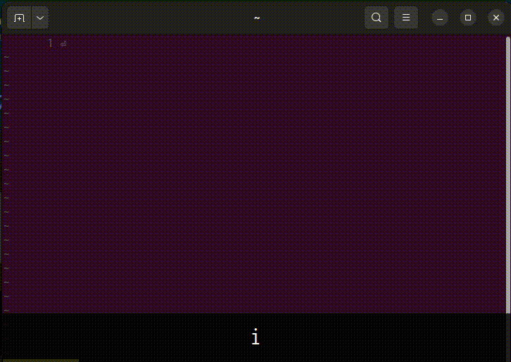

# asyncomplete-spell

## 概要

[asyncomplete.vim](https://github.com/prabirshrestha/asyncomplete.vim) の補完で正しいスペル補完候補をだす

## 要件

* Vim 8.0 以上
* [asyncomplete.vim](https://github.com/prabirshrestha/asyncomplete.vim)

## インストール

使用しているパッケージ・マネージャに従えば良い

### [Vundle](https://github.com/gmarik/vundle)

``` vim
Plug 'iranoan/asyncomplete-spell'
```

### [Vim-Plug](https://github.com/junegunn/vim-plug)

``` vim
Plug 'iranoan/asyncomplete-spell'
```

### [NeoBundle](https://github.com/Shougo/neobundle.vim)

``` vim
NeoBundle 'iranoan/asyncomplete-spell'
```

### [dein.nvim](https://github.com/Shougo/dein.vim)

``` vim
call dein#add('iranoan/asyncomplete-spell')
```

### Vim packadd

``` sh
git clone https://github.com/iranoan/asyncomplete-spell ~/.vim/pack/iranoan/start/asyncomplete-spell
```

遅延読み込みをさせるなら

``` sh
git clone https://github.com/iranoan/asyncomplete-spell ~/.vim/pack/iranoan/opt/asyncomplete-spell
```

## 設定方法

\~/.vim/vimrc などの設定ファイルに次のような記載を加える

``` vim
call asyncomplete#register_source(asyncomplete#sources#spell#get_source_options({
  \ 'priority': 5,
  \ }))
\ }))
```

英語を想定しているので、それ以外の言語で使う場合は綴りに使う文字設定必要で、デフォルト相当は

``` vim
call asyncomplete#register_source(asyncomplete#sources#spell#get_source_options({
  \ 'refresh_pattern': '\m\c\([A-Z]\{2,}\|[A-Z]\+''[A-Z]\+\)$',
  \ 'allowlist': ['*'],
  \ }))
```

## 使用方法



設定が終われば、[asyncomplete.vim](https://github.com/prabirshrestha/asyncomplete.vim) の補完候補に正しいスペルとメニュー項目として

* タイプされている単語が正しければ [spell:good]
* そうでなければ [spell:--] と -- 部に
[spellbadword()](https://vim-jp.org/vimdoc-ja/builtin.html#spellbadword%28%29)
によるスペルミスの種類を表示する

また

* 単語ごとに2文字以上で補完候補に加える
* [asyncomplete.vim](https://github.com/prabirshrestha/asyncomplete.vim) 
は標準設定では前方一致で補完候補を絞り込むので、追加・表示される補完候補は 
[z=](https://vim-jp.org/vimdoc-ja/spell.html#z=), 
[i\_CTRL-X\_CTRL-S](https://vim-jp.org/vimdoc-ja/insert.html#i_CTRL-X_CTRL-S) 
([i\_CTRL-X\_s](https://vim-jp.org/vimdoc-ja/insert.html#i_CTRL-X_s)) 
より少なくなる
* CamelCase の綴りは全体でスペル・チェックしてミスが有る場合は、末尾部分で大文字で区切った最長一致でチェックしている  
  例えば LuaLaTeX では、次の順でチェックしていく
  * LuaLaTeX
  * LaTeX
  * TeX

### z=, i\_CTRL-X\_CTRL-S (i\_CTRL-X\_s) 相当を表示させる方法

g:asyncomplete\_preprocessor を設定すれば良い

例えば重複を除きつつ、asyncomplete-spell 以外は大文字・小文字を区別しない前方一致で絞り込ませるのは次の設定

```vim
let g:asyncomplete_preprocessor = [function('s:asyncomplete_preprocessor')]

function s:asyncomplete_preprocessor(options, matches) abort
  let l:visited = {}
  let l:items = []
  let l:base = '^\m' .. escape(a:options['base'], '\.$*~')
  for [l:source_name, l:matches] in items(a:matches)
    for l:item in l:matches['items']
      if !has_key(l:visited, l:item['word'])
            \ && ( l:source_name ==# 'spell' || l:item['word'] =~? l:base )
        call add(l:items, l:item)
        let l:visited[l:item['word']] = 1
      endif
    endfor
  endfor
  call asyncomplete#preprocess_complete(a:options, l:items)
endfunction
```
